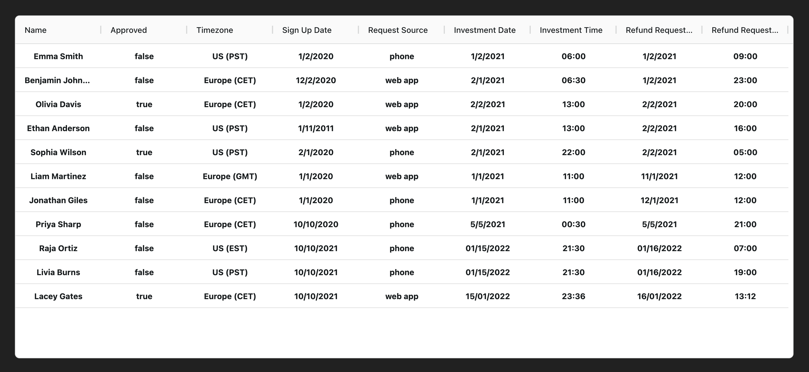

# Refund Manager Tech Test

## Setup

1. Clone the repository into your local machine
2. Navigate to the root folder of the project in your terminal
3. Run `npm install` to install the dependencies
4. Run `npm run dev` to start the development server
5. Open your browser and go to `http://localhost:5173`

You should see the approvals state displayed on the page like this:

## Instructions

An investor may receive a refund on their investment into a fund based on specific time limits, which vary depending on whether the requester had signed up to the old or new Terms of Service (TOS) and whether the reversal request was submitted via the phone or on the web-app.

| Request Type | Approval time limit for old TOS | Approval time limit for new TOS |
| ------------ | ------------------------------- | ------------------------------- |
| On the phone | 4 hours after investment        | 24 hours after investment       |
| Web app      | 8 hours after investment        | 16 hours after investment       |

### Dates

US customers follow the date format MONTH/DAY/YEAR, whereas Europeans use DAY/MONTH/YEAR. An investor is subject to the new TOS if they signed up after 1/2/2020 for US customers and after the equivalent date of 2/1/2020 for Europeans. The date in the table below is already formatted based on the users location.

### Special phone call rules

Requests made via phone can only be registered within business hours (Mon-Fri, 9am-5pm UK time). Requests made over the phone outside of these times are logged to voicemail but are not registered for the purposes of working out refund elegibility until the next business hours window, e.g:

- If a phone call is made at 7pm UK time on a Monday, the request will be deemed as having been requested at 9am on Tuesday.
- If a phone call is made at 7pm UK time on a Friday, the request will be deemed as having been requested at 9am on the following Monday.
- If a phone call is made at 4.45pm UK time, the request is registered immediately.

### Clarifications

- `Refund Request Time` for phone calls in the table below is the time the phone call was made, not registered (as per the rules above). Web app requests are registered immediately at any time of day.
- `Investment Time` and `Refund Request Time` are the customer's local time at their location
- `EST` is Eastern Standard Time (e.g. New York), `PST` is Pacific Standard Time (e.g. Los Angeles), and `CET` is Central European Time (e.g. Paris)

The table below gives you a list of customers' reversal requests.

| Name             | Customer Location (timezone) | Sign up date | Request Source | Investment Date | Investment Time | Refund Request Date | Refund Request Time |
| ---------------- | ---------------------------- | ------------ | -------------- | --------------- | --------------- | ------------------- | ------------------- |
| Emma Smith       | US (PST)                     | 1/2/2020     | phone          | 1/2/2021        | 06:00           | 1/2/2021            | 09:00               |
| Benjamin Johnson | Europe (CET)                 | 12/2/2020    | web app        | 2/1/2021        | 06:30           | 1/2/2021            | 23:00               |
| Olivia Davis     | Europe (CET)                 | 1/2/2020     | web app        | 2/2/2021        | 13:00           | 2/2/2021            | 20:00               |
| Ethan Anderson   | US (PST)                     | 1/11/2011    | web app        | 2/1/2021        | 13:00           | 2/2/2021            | 16:00               |
| Sophia Wilson    | US (PST)                     | 2/1/2020     | phone          | 2/1/2021        | 22:00           | 2/2/2021            | 05:00               |
| Liam Martinez    | Europe (GMT)                 | 1/1/2020     | web app        | 1/1/2021        | 11:00           | 11/1/2021           | 12:00               |
| Jonathan Giles   | Europe (CET)                 | 1/1/2020     | phone          | 1/1/2021        | 11:00           | 12/1/2021           | 12:00               |
| Priya Sharp      | Europe (CET)                 | 10/10/2020   | phone          | 5/5/2021        | 00:30           | 5/5/2021            | 21:00               |
| Raja Ortiz       | US (EST)                     | 10/10/2021   | phone          | 01/15/2022      | 21:30           | 01/16/2022          | 07:00               |
| Livia Burns      | US (PST)                     | 10/10/2021   | phone          | 01/15/2022      | 21:30           | 01/16/2022          | 19:00               |
| Lacey Gates      | Europe (CET)                 | 10/10/2021   | web app        | 15/01/2022      | 23:36           | 16/01/2022          | 13:12               |

Write a small front end application that will take in the data in the table above and display whether each refund request should be approved or denied. The emphasis of the application should be on solving the problem, and much less on the architecture, design, etc.

### Execution Notes

#### Assumptions

- TIMEZONE (GMT vs CET) makes no difference to this test as they are consistent for each customer

- The investment date and time IS the time that it was registered - not the time the investment was requested. Therefore we calculate the refund request time limit from then.

- We also assume that the TOS "hours after investment" continue to count down out of business hours.
- If you placed an investment at 6:00pm on a Monday on the phone and were under the old TOS, the refund request time limit would be at 10pm that Monday. Making it impossible to refund.
